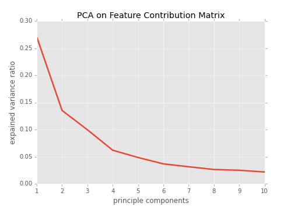
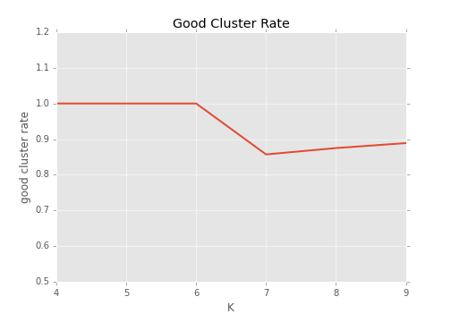

#  Women in the Workforce

**Data Source**

[General Social Survy(GSS)](https://gssdataexplorer.norc.org/) is a sociological survey which monitors demographic attitudes and living conditions of residents of the United States. The entire data is accessible to public and is one of most commonly used data source in social science study.

## Big Picture Question
What factors influence women's working statuses is Uinited States in past two decades?

To Answer this question, first I have to know what does women's employment status look like and how is it different from the male population?

## employment

| Sex   | Employed | Unemployed |  Sum  | p-value |
| ----- | ------   | -----      | ----- | ------  |
| Men   | 9290     | 1498       | 10788 |         |
| Women  | 9416    | 4404       | 13820 |         |
| **sum**  | 18706 | 5902       | 24608 | 0.0     |

In past two decades, women's employment rate is lower than the men's. And the sample proportion z-test result showed this difference is significant.

Then I would like to know how women's employment statuses look like in different family status.

The above figure shows that Women who have children under six and thirteen years old yield lowest hiring rate. This result implies that women are more likely to leave the workforce at this stage.

Amongst the women who have children under thirteen-year-old, who are the working ones? And what motivate them to work? The rest of my research will focus on answering these questions using survey data.

## Result

According to what random forest model suggests women with children under thirteen-year-old fall into six categories. Three subsets are the working and three are unemployed.

### Employed women

Women with children under thirteen-year-old who stay in the work force falls into the following three categories.

**Category One**

Women in this category are more likely grew up in low-income family, have first child early (under 20) and work as blue collar workers.

**Category Two**

Their highest earned degree are more likely to be high school and they are either never married, separated or divorced, aka single moms. To raise the children and support family, they choose to work.

**Category Three**

Women in this category are more likely to have higher degrees and identify themselves in the middle class. They have diverse party affiliation and political views. They takes up the largest proportion of the employed women.

### Unemployed Women

Women with children under thirteen-year-old who leave the work force falls into the following three categories.

**Category Four**

Women in this category are more likely to have children early, grow up in low-income families. Their highest earned education degrees are less than high school.

**Category Five** 

Women in this category are more likely to have high school degree, consider their family income below average and their spouses work over 40 hours per week.

**Category Six**

Women in this category are more likely to be riased in rich families. Their spouses works about 50 hours a week. They tend to be more conservative and religious. 

## Method

### Random Forest and Survey Data

Processed survey data contains 4469 female respondents with children under thirteen years old and 144 survey questions range from employment status to political views. This data is passed to random forest model with employment status as predicted variable. First forty Important features from first round random forest model are selected as independent variables to fit the second round random forest model. After grid search, the second round random forest model yield 0.81 roc_auc score.

### Tree Interpreter

In order to understand how random forest predict respondents employment using survey data, Tree Interpreter module is implemented. Tree Interpreter module use feature contribution algorithm to render an insight how each feature contributes to model decision path. Feature contribution consists of two steps: 1) Calculate local increment of feature contribution for each tree. 2) Average feature contribution across the forest. Trained random forest model and entire survey data set are passed to tree interpreter module and return a feature contribution matrix as a result. Table 2 is a simplified demo of feature contribution matrix generated by Tree Interpreter.

| index   | coninc | age    |  sphrs1  | ...      | employed |
| -----   | ------ | -----  | -----    | ------   | ------   |
| 0       | -0.0241| 0.0122 | 0.003    | ...      | True     |
| 1       | 0.003  | -0.004 | -0.018   | ...      | False    |

To interpret how features contribute to model's decision, let's take a look at first row of matrix for instance. The feature coninc lowers this subject's probability of being employed by 2.41%, at the mean time, the feature age enhances this probability by 1.22%. The final prediction of this subject is the sum each feature contribution, then plus bias which is the value of the root of the node.

### Clustering Feature Contribution Matrix

We need to find out common contribution paths within each target label. Using Kmeans to cluster feature contribution matrix is a reasonable approach. However, the matrix has 40 columns, so before clustering, PCA is necessary for dimension reduction.

Figure 6 displays the explained variance ratio for each principle component from feature contribution matrix. First three principle components are chosen to transform the matrix, because their cumulated variance can explain over 50% of variance.  

To determine which k for kmeans. a function is written to check kmeans cluster performance. It takes a range of Ks and make a for loop. In each loop it generates k clusters using kmeans, concatenates cluster id to 'employed' and 'correct' columns to make a new data frame. Then group data frame by cluster id, calculate employed rate and correct rate by taking means.
If the employed rate is higher than 0.7 or lower than 0.3, then we can say this cluster successfully cluster employed or unemployed population, so this cluster yields pure population of interest.If the correct rate is higher than 0.7, we can say this cluster has hight accuracy. The clusters with pure population and meantime with high accuracy are ones we want. The percentage of good cluster rate for each Kmeans is Calculated and plot against number of K.

According to Figure 7, Kmeans can cluster target clearly when the K is small than 7.

Then we plot average silhoutte score against K (Figure 8), it suggests that it yields the highest silhoutte Score (0.52) when K is 6. Figure 9 visualizes silhoutte scores for each cluster generated by Kmeans when K is 6. It suggests that all the clusters have considerable proportion above average silhoutte score. Therefore we set n_cluster at six to conduct Kmeans.

After PCA and Kmeans, each row has a cluster id indicating which cluster it belongs to. Employed rate and correct rate are Calculated with cluster and presented as Figure 10. Cluster 1, 2,5 are unemployed groups and Cluster 0,3,4 are the unemployed groups. Each cluster displays pure employment status and high accuracy, therefore we can move on to next step.

### Cluster study
Since the feature Contribution matrix shares the same structure as survey data frame, whose rows are the respondents and columns are the survey questions, we can concatenate cluster id to the survey data frame. This new survey data set is saved as df_id. 

Each cluster is compared with rest of population using sample proportion z-test.  