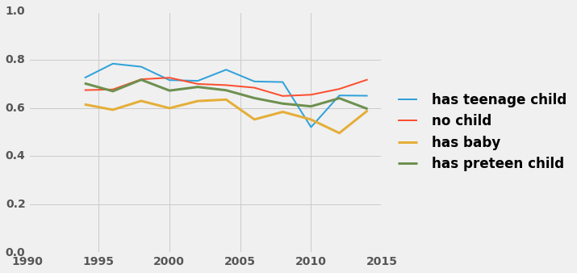
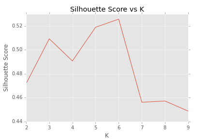

#  Women in the Workforce

**Data Source**

The [General Social Survy(GSS)](https://gssdataexplorer.norc.org/) is a sociological survey which monitors demographic attitudes and living conditions of residents of the United States. The entire data is accessible to the public and is one of the most commonly used data source in social science studies.

* [Big Picture Question](#Big Picture Question)

* [employment](#Employment)

## Big Picture Question

**What factors influenced women's working statuses in United States in the past two decades?**

To answer this question, first I had to know how women's employment statuses differed from men's.

## Employment

| Sex   | Employed | Unemployed |  Sum  | p-value |
| ----- | ------   | -----      | ----- | ------  |
| Men   | 9290     | 1498       | 10788 |         |
| Women  | 9416    | 4404       | 13820 |         |
| **sum**  | 18706 | 5902       | 24608 | 0.0     |

In past two decades, women's employment rates were lower than men's, and the sample proportion z-test result showed this difference is significant. Next, I wanted to see how women's employment statuses were affected by their family statuses.

After finding that women with children under 13 are the most likely to leave the workforce, I then focused on using the survey data to answer these two questions : First, of the women with children under 13, which are more likely to work, and secondly what motivates them to work?

## Result

According to what the random forest model suggests, women with children under thirteen years old fall into six categories. Three subsets are employed and three are not.

### Employed women

Women with children under thirteen years old who stay in the work force fall into the following three categories.

**Category One**

Women in this category are more likely to have grew up in a low-income family, to have had their first child early (under 20), and to work in blue-collar jobs.

**Category Two**

In this category, women are more likely to only have a high school diploma; never have been married; or are separated or divorced. Essentially, they are single moms. To raise the children and support their family, they choose to work.

**Category Three**

Women in this category are more likely to have higher degrees and identify themselves as middle-class. They have diverse party affiliations and political views. They make up the largest portion of the employed women.

### Unemployed Women

Women with children under thirteen years old who leave the work force fall into the following three categories.

**Category Four**

Women in this category are more likely to have children early, grow up in low-income families, and their highest education is less than high school.

**Category Five**

Women in this category are more likely to have high school degrees, consider their family income below average, and their spouses work over 40 hours per week.

**Category Six**

Women in this category are more likely to be raised in rich families. Their spouses work about 50 hours a week. They tend to be more conservative and religious.

## Method

### Random Forest and Survey Data

The processed survey data contains 4469 female respondents with children under thirteen years old and 144 survey questions ranging from employment status to political views. This data is passed to the random forest model with employment status as the predicted variable. First, forty important features were selected by random forest to fit the second round  of modeling. After a grid search, the second round random forest model yielded a 0.81 roc_auc score.

### Tree Interpreter
The Tree Interpreter module is used to understand how random forest predicts respondents' employment using survey data. This module uses a feature contribution algorithm to provide insights into how each feature contributes to the model's decision path. Feature contribution consists of two steps: 1) Calculate a local increment of feature contribution for each tree. 2) Average feature contributions across the forest. The trained random forest model and the entire survey data set are passed to tree interpreter module and return a feature contribution matrix as a result. Table 2 is a simplified demo of feature contribution matrix generated by Tree Interpreter.

| index   | coninc | age    |  sphrs1  | ...      | employed |
| -----   | ------ | -----  | -----    | ------   | ------   |
| 0       | -0.0241| 0.0122 | 0.003    | ...      | True     |
| 1       | 0.003  | -0.004 | -0.018   | ...      | False    |

To interpret how features contribute to model's decision, let's take a look at first row of matrix. The feature coninc lowers this subject's probability of being employed by 2.41%, at the mean time, the feature age enhances this probability by 1.22%. The final prediction of this subject is the sum of each feature's contribution plus the bias (which is the value of the root of the node).

### Clustering Feature Contribution Matrix

Next, we need to find out common contribution paths within each target label. Using Kmeans to cluster the feature contribution matrix is a reasonable approach. However, the matrix has 40 columns, so before clustering, PCA is necessary for dimension reduction.

According to the figure above, first three principle components are chosen to transform the matrix, because their cumulated variance can explain over 50% of the variance.  

To determine how many Ks (# of clusters) are best for kmeans. A function is written to check kmeans' performance. It takes a range of Ks and makes a for loop. In each loop it generates k clusters using kmeans, concatenates cluster id to 'employed' and 'correct' columns to make a new data frame. Then, group the data frame by cluster id, calculates employed rate, and correct rate by taking means.

If the employed rate is higher than 0.7 or lower than 0.3, then we can say this cluster successfully separate employed or unemployed populations, so this cluster yields pure populations of interest. If the correct rate is higher than 0.7, we can say this cluster has high accuracy. Therefore, clusters with pure population and with high accuracy are the ones we want. The percentage of good cluster rates for each Kmeans is calculated and plotted against the number of Ks.

According to the figure above, Kmeans can cluster targets clearly when the K is smaller than 7.

The averaged silhouette scores are plotted against K, and it showed that the Silhoutte Score yields the highest (0.52) when K is 6. Therefore we set n_cluster at six to conduct Kmeans.

After PCA and Kmeans, each row has a cluster id indicating which cluster it belongs to. Employed rate and correct rate in each cluster are calculated. Clusters 1, 2, and 5 are unemployed groups and clusters 0, 3, and 4 are the unemployed groups. Each cluster displays pure employment status and high accuracy, therefore we can move on to the final step.

### Cluster study
Since the feature Contribution matrix shares the same structure as the survey data frame, whose rows are the respondents and columns are the survey questions, we can concatenate by cluster id to the survey data frame. This new survey data set is saved as df_id.

Each cluster is compared with the rest of the population using a sample proportion z-test.  

## Reference

Palczewska, A., Palczewski, J., Robinson, R. M., & Neagu, D. (2013, August). Interpreting random forest models using a feature contribution method. In Information Reuse and Integration (IRI), 2013 IEEE 14th International Conference on (pp. 112-119). IEEE.

Datadivenet. (2016). Datadivenet. Retrieved 12 January, 2016, from http://blog.datadive.net/interpreting-random-forests/

Datadivenet. (2016). Datadivenet. Retrieved 12 January, 2016, from http://blog.datadive.net/random-forest-interpretation-with-scikit-learn/
