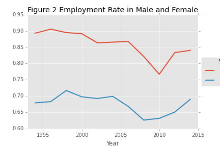

# Women in the Workforce

[Abstract](#abstract)

[Introduction](#introduction)

[Result](#result)

[Method](#method)

## Abstract

## Introduction

While more and more women attain higher education, the employment rate of women is still lower than men. Gender distribution in the labor force has been wildly studied, however, there's quite few research identify which features are shared among women stay in workforce and which are the main driving force to drag women quit jobs when their family status change. To answer these questions, random forest classification model is applied on survey data obtained from General Social Survey(GSS). Feature contribution algorithm is implemented to explain how random forest utilize survey questions and respondents' answers to determine respondents' employment status. 

General Social Survey is a sociological survey used to monitor demographic attitudes and living conditions of residents of the United States. Respondents are interviewed in-person at the University of Chicago. The survey has been started since 1972, conducted very year until 1994, and every other year since 1994. The entire data set is accessible to public and is one of most commonly used data source in social science study. This paper uses subset of GSS data collected from past two decades. 

Random Forest is a frequently used model for many classification projects given its high accuracy. It is used in this study to predict women employment status based on their responses to survey questions on their political opinions and personal histories. Nevertheless, like other "black box" models, its lack of explanatory information between variables and predicted target labels makes random forest less interpretable. This paper uses feature contribution method on random forest to determine the influence of each variable. 

## Result

### Employment status in past two decades

Data is grouped by years to calculate employment rate and unemployment rate. A plot chart (Figure 1) is generated to displayed yearly trend. 

    
    

The yearly employment rate is stable overall, which maintains between 75% to 80%, except the recession period dropped below 70% shortly. 

The employment rate exhibits difference across genders (Figure 2). Women always yield lower employment rate at each time point. 

To confirm this difference is significant, sample ratio z-test is conducted on overall employment rate of men and women. The p-value is 0.0, which suggests that women's employment rate is significantly lower than that of men. 

Table 1

 | Sex       | Employed  | Unemployed| Sum   | p-value|
 | --------  | --------- | --------- | ----- | ------ |
 | Men       | 9290      | 1498      | 10788 |        |
 | Women     | 9416      | 4404      | 13820 |        |
 | **sum**   | 18706     | 5902      | 24608 | 0.0    |
 

| color | number | label |
| ----- | ------ | ----- |
| blue  | 1      | 0     |
| blue  | 2      | 1     |
| red   | 1      | 0     |
| red   | 5      | 1     |

## Method

### Employment study
Subset data collected between 1994 and 2014 from GSS Data Explorer site. Selected features include year, respondent id, labor force status, number of hours worked last week (hrs1), number of hours work a week (hrs2), marital status, respondent sex, household members under six years old, 6 through 12 years old, 13 through 17 years old, 18 years old and above, and level of happiness. 

Since hrs1 and hrs2 contains similar information, they are merged as a new column indicating respondents' general working hours. Retired and school respondents are either quit or not join the labor force yet, we can filter these subjects out. An "employed" column is created to simplify working status information. "Working fulltime" and "working parttime" are treated as employed and labeled as "True", whereas the rest are labeled as "False".

To further reduce the complexity, respondents who have family member under six years old are label "True" in "has_baby" column, otherwise label "False". Same method is applied to "has_preteen" and "has_teen" columns. 

