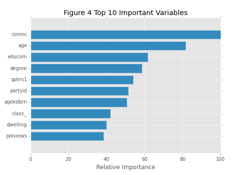
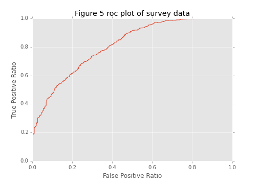

# Women in the Workforce

* [Abstract](#abstract)

* [Introduction](#introduction)

* [Result](#result)

* [Method](#method)

## Abstract

## Introduction

While more and more women attain higher education, the employment rate of women is still lower than men. Gender distribution in the labor force has been wildly studied, however, there's quite few research identify which features are shared among women stay in workforce and which are the main driving force to drag women quit jobs when their family status change. To answer these questions, random forest classification model is applied on survey data obtained from General Social Survey(GSS). Feature contribution algorithm is implemented to explain how random forest utilize survey questions and respondents' answers to determine respondents' employment status. 

General Social Survey is a sociological survey used to monitor demographic attitudes and living conditions of residents of the United States. Respondents are interviewed in-person at the University of Chicago. The survey has been started since 1972, conducted very year until 1994, and every other year since 1994. The entire data set is accessible to public and is one of most commonly used data source in social science study. This paper uses subset of GSS data collected from past two decades. 

Random Forest is a frequently used model for many classification projects given its high accuracy. It is used in this study to predict women employment status based on their responses to survey questions on their political opinions and personal histories. Nevertheless, like other "black box" models, its lack of explanatory information between variables and predicted target labels makes random forest less interpretable. This paper uses feature contribution method on random forest to determine the influence of each variable. 

## Result

### Employment status in past two decades

Data is grouped by years to calculate employment rate and unemployment rate. A plot chart (Figure 1) is generated to displayed yearly trend. 

[figure 1]

The yearly employment rate is stable overall, which maintains between 75% to 80%, except the recession period dropped below 70% shortly. 

The employment rate exhibits difference across genders (Figure 2). Women always yield lower employment rate at each time point. 

[figure 2]

To confirm this difference is significant, sample ratio z-test is conducted on overall employment rate of men and women. The p-value is 0.0, which suggests that women's employment rate is significantly lower than that of men. 

Table 1 

| Sex   | Employed | Unemployed |  Sum  | p-value | 
| ----- | ------   | -----      | ----- | ------  | 
| Men   | 9290     | 1498       | 10788 |         | 
| Women  | 9416    | 4404       | 13820 |         |
| **sum**  | 18706 | 5902       | 24608 | 0.0     |

To further investigate women at which stage yield the lowest hiring rate, data is further split according to the age range of respondents' family members. Yearly employment rate for each metadata is calculated and plotted against years (Figure 3). Women who have children under six and thirteen years old exhibit lowest hiring rate. This result is consistent with other labor force study using other data source. Therefore, these two subsets of respondents are extracted for further study.

[Figure 3]

### Random Forest and Survey Data

Processed survey data contains 4469 female respondents with children under thirteen years old and 144 survey questions range from employment status to political views. This data is passed to random forest model with employment status as predicted variable and rest features as independent variables. First forty Important features from first round random forest model are selected as independent variables to fit the second round random forest model. After grid search, the second round random forest model yield 0.81 roc_auc score. 

### Tree Interpreter

In order to understand how random forest predict respondents employment using survey data, Tree Interpreter module is implemented. Tree Interpreter module use feature contribution algorithm to render an insight how each feature contributes to model decision path. Feature contribution consists of two steps: 1) Calculate local increment of feature contribution for each tree. 2) Average feature contribution across the forest. Trained random forest model and entire survey data set are passed to tree interpreter module and return a feature contribution matrix as a result. Table 2 is a simplified demo of feature contribution matrix generated by Tree Interpreter. 

Table 2

| index   | coninc | age    |  sphrs1  | ...      | employed | 
| -----   | ------ | -----  | -----    | ------   | ------   | 
| 0       | -0.0241| 0.0122 | 0.003    | ...      | True     | 
| 1       | 0.003  | -0.004 | -0.018   | ...      | False    |

To interpret how features contribute to model's decision, let's take a look at first row of matrix for instance. The feature coninc lowers this subject's probability of being employed by 2.41%, at the mean time, the feature age enhances this probability by 1.22%. The final prediction of this subject is the sum each feature contribution, then plus bias which is the value of the root of the node. 

### Clustering Feature Contribution Matrix

To further classify employed and unemployed women, more studies are needed on feature contribution matrix. To see how random forest classified samples, we need to find out common contribution paths among samples. Using Kmeans to cluster feature contribution matrix is a reasonable approach. However, the matrix has 40 columns, so before clustering, PCA is necessary for dimension reduction.

## Method

### Employment 
Subset data collected between 1994 and 2014 from GSS Data Explorer site. Selected features include year, respondent id, labor force status, number of hours worked last week (hrs1), number of hours work a week (hrs2), marital status, respondent sex, household members under six years old, 6 through 12 years old, 13 through 17 years old, 18 years old and above, and level of happiness. 

Since hrs1 and hrs2 contains similar information, they are merged as a new column indicating respondents' general working hours. Retired and school respondents are either quit or not join the labor force yet, we can filter these subjects out. An "employed" column is created to simplify working status information. "Working full time" and "working part time" are treated as employed and labeled as "True", whereas the rest are labeled as "False".

To further reduce the complexity, respondents who have family member under six years old are label "True" in "has_baby" column, otherwise label "False". Same method is applied to "has_preteen" and "has_teen" columns. 

### Survey data processing

Before fitting survey data into random forest model, feature engineering is necessary. A class function is written to treat survey data set as an object and process it as a whole. The process steps include: 1. Convert column names from survey questions to short names. 2. Subset female respondents with children under thirteen years old. 3.Create a new column indicating whether the respondent is employed. 4. Impute some missing values in numerical variables with median. 5. Flag "Not applicable", "No answer" or string answers in numerical variables. 6. Convert categorical dat to numerical using GSS.sps file under data directory. 7. Create “educom” column which combine each respondent's father, mather and spouse's highest year school completed, then take average. This new feature can be interpreted as average education level of respondent's family members. 

### Tree Interpreter and Feature Contribution

Tree Interpreter module is obtained from [here](https://github.com/andosa/treeinterpreter). This model requires sclera 0.17. [Here](http://scikit-learn.org/stable/install.html#install-bleeding-edge) is sklearn upgrade instruction. 

Generated feature contribution matrix is concatenated with true target labels as well as a bool column indicating whether the predictions are correct. This new data frame is dumped to pickle and saved as fc_df2 under data directory. 